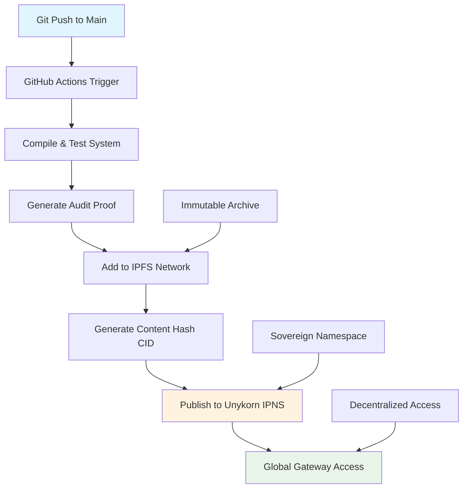

# 📦 IPFS Deployment Guide - Unykorn Sovereign Namespace

## 🌍 Overview

The FTH Gold Exchange system automatically publishes to **IPFS (InterPlanetary File System)** under the **Unykorn sovereign namespace**, creating immutable, decentralized mirrors of the entire fraud-proof precious assets trading platform.

### 🎯 Benefits of IPFS Integration

- **🔒 Immutable Storage**: Cannot be altered, deleted, or censored
- **🌐 Global Accessibility**: Available from anywhere, no single point of failure  
- **🛡️ Infrastructure Protection**: Anti-fraud system itself becomes fraud-proof
- **⚖️ Legal Evidence**: Cryptographic proof for compliance and audits
- **🏛️ Sovereign Identity**: Published under Unykorn decentralized namespace

---

## 🏗️ Architecture

### Traditional vs IPFS-Enhanced System

```
Traditional GitHub Only:
GitHub → Centralized → Single Point of Failure

IPFS-Enhanced System:  
GitHub → IPFS → Global Network → Unykorn Namespace → Immutable Access
```

### IPFS Publication Flow



---

## 🔧 Setup Instructions

### 1. GitHub Secrets Configuration

Add these secrets to your repository:

| Secret Name | Description | Example |
|-------------|-------------|---------|
| `UNYKORN_IPFS_KEY` | Base64-encoded IPNS private key | `base64-encoded-key-data` |
| `IPFS_API_TOKEN` | Optional: Pinata/Web3.Storage API key | `your-api-token` |

### 2. Generate Unykorn IPNS Key

```bash
# Install IPFS CLI
wget https://dist.ipfs.tech/kubo/v0.24.0/kubo_v0.24.0_linux-amd64.tar.gz
tar -xzf kubo_v0.24.0_linux-amd64.tar.gz
sudo bash kubo/install.sh

# Initialize IPFS
ipfs init
ipfs daemon &

# Generate Unykorn key
ipfs key gen --type=ed25519 unykorn

# Export for GitHub Secrets (save this output)
ipfs key export unykorn | base64
```

### 3. Add to GitHub Secrets

1. Go to: `https://github.com/YOUR_USERNAME/fthgoldexchange/settings/secrets/actions`
2. Click "New repository secret"
3. Name: `UNYKORN_IPFS_KEY`
4. Value: Paste the base64 output from step 2
5. Click "Add secret"

---

## 🚀 Automatic Publication

### Trigger Events

IPFS publication happens automatically on:
- **Every push to main branch** (automatic)
- **Manual workflow dispatch** (on-demand)
- **Release creation** (tagged versions)

### What Gets Published

The complete system including:
- ✅ **Smart Contracts** (all 6 production contracts)
- ✅ **Business Documentation** (audit, financial model) 
- ✅ **Security Framework** (audits, monitoring)
- ✅ **Deployment Scripts** (CI/CD automation)
- ✅ **Demo Assets** (gold, diamond, silver examples)
- ✅ **Compliance Framework** (global regulatory support)

### Publication Artifacts

Each publication creates:
- **📦 Content Hash (CID)**: Immutable reference to exact version
- **🏛️ IPNS Address**: Updatable Unykorn namespace pointer
- **📋 Audit Proof**: Cryptographic integrity verification
- **📊 Publication Report**: Access points and verification commands

---

## 🌍 Access Methods

### 1. IPFS Content Hash (Immutable)

Each version gets a unique content hash:
```
bafybeig7xqnb4zt5t7t5t5t5t5t5t5t5t5t5t5t5t5t5t5t5t5
```

**Direct Access URLs**:
- https://ipfs.io/ipfs/CONTENT_HASH
- https://gateway.pinata.cloud/ipfs/CONTENT_HASH  
- https://cf-ipfs.com/ipfs/CONTENT_HASH
- https://dweb.link/ipfs/CONTENT_HASH

### 2. Unykorn IPNS (Always Latest)

Unykorn namespace always points to latest version:
```
k51qzi5uqu5dk9kg4jb3vtr5t5t5t5t5t5t5t5t5t5t5t5t5t5
```

**Named Access URLs**:
- https://ipfs.io/ipns/k51qzi5uqu5dk9...
- ipfs://ipns/k51qzi5uqu5dk9...

### 3. Local IPFS Node

```bash
# Add IPFS content
ipfs get CONTENT_HASH -o fth-gold-exchange

# Resolve Unykorn namespace
ipfs name resolve UNYKORN_IPNS_HASH

# Pin content locally
ipfs pin add CONTENT_HASH
```

---

## 🛡️ Security & Integrity

### Cryptographic Verification

```bash
# Verify content integrity
ipfs dag get CONTENT_HASH

# Check file hashes
ipfs files stat /ipfs/CONTENT_HASH

# Verify IPNS signature  
ipfs name resolve --verify UNYKORN_IPNS_HASH
```

### Audit Trail

Each publication includes:
- **🕐 Timestamp**: UTC publication time
- **🔗 Git Commit**: Exact source code version
- **📝 Changes**: Commit message and diff
- **🔒 Signature**: Unykorn namespace cryptographic proof
- **📊 Integrity**: Complete file inventory with hashes

---

## 📊 Monitoring & Status

### Live Status Check

View current IPFS status:
- **GitHub Actions**: Check deployment logs
- **System Status**: Monitor `SYSTEM_STATUS.md`
- **Publication Issues**: Auto-created GitHub issues

### Gateway Health

Check gateway accessibility:
```bash
# Test primary gateway
curl -I https://ipfs.io/ipfs/CONTENT_HASH

# Test backup gateways  
curl -I https://gateway.pinata.cloud/ipfs/CONTENT_HASH
curl -I https://cf-ipfs.com/ipfs/CONTENT_HASH
```

---

## 🚨 Emergency Procedures

### Manual Publication

If automatic publication fails:

```bash
# Clone repository
git clone https://github.com/kevanbtc/fthgoldexchange.git
cd fthgoldexchange

# Install IPFS
ipfs init && ipfs daemon &

# Add to IPFS
CID=$(ipfs add -r . --pin=true --cid-version=1 | tail -n1 | awk '{print $2}')

# Import Unykorn key (from GitHub Secrets)
echo "BASE64_KEY_DATA" | base64 -d | ipfs key import unykorn -

# Publish to IPNS
ipfs name publish --key=unykorn /ipfs/$CID
```

### Recovery Procedures

1. **Lost IPNS Key**: Generate new key, update GitHub Secrets
2. **Gateway Failures**: Use alternative gateways or local node
3. **Content Missing**: Re-publish from GitHub using manual procedure
4. **Network Issues**: Wait for IPFS network propagation (up to 24h)

---

## 🔗 Integration Examples

### Web3 Application Integration

```javascript
// Access latest version via IPNS
const ipfsHash = await ipfs.name.resolve('UNYKORN_IPNS_HASH');

// Load smart contract ABIs
const contractABI = await fetch(`https://ipfs.io${ipfsHash}/contracts/PreciousAssetVault.json`);

// Verify integrity
const expectedHash = 'KNOWN_CONTENT_HASH';
const actualHash = await ipfs.files.stat(`${ipfsHash}/contracts`);
```

### Legal/Compliance Integration

```bash
#!/bin/bash
# Compliance audit script

# Download immutable version
ipfs get AUDIT_CONTENT_HASH -o audit-snapshot/

# Generate evidence package
tar -czf legal-evidence.tar.gz audit-snapshot/
sha256sum legal-evidence.tar.gz > legal-evidence.sha256

# Timestamp proof
echo "$(date -u): IPFS audit package created" >> audit-log.txt
```

---

## 📈 Benefits for Stakeholders

### For Investors
- **🔒 Immutable Due Diligence**: Code and documentation cannot be altered post-review
- **📊 Version History**: Complete audit trail of all system changes
- **🌍 Always Accessible**: Due diligence materials available globally 24/7

### For Regulators  
- **⚖️ Legal Evidence**: Cryptographically verifiable system snapshots
- **📋 Compliance Trail**: Immutable record of regulatory compliance
- **🔍 Audit Support**: Permanent preservation of audit evidence

### For Partners
- **🤝 Trust**: Transparent, verifiable system specifications
- **🔧 Integration**: Always-available API documentation and contracts
- **📦 Backup**: Decentralized backup of all partnership materials

---

## 🎯 Future Enhancements

### Planned Features
- **📱 Mobile IPFS Access**: Direct mobile app integration
- **🔔 Publication Notifications**: Real-time alerts for new versions
- **📊 Analytics Dashboard**: IPFS access statistics and metrics
- **🌐 Custom Gateways**: Dedicated high-performance gateways

### Advanced Integration
- **⚡ IPLD Integration**: Linked data structures for complex queries
- **🔄 Version Control**: Semantic versioning with IPFS branches  
- **🛡️ Enhanced Security**: Multi-signature IPNS updates
- **📈 Performance**: CDN integration with IPFS gateways

---

## 📞 Support & Troubleshooting

### Common Issues

| Issue | Solution |
|-------|----------|
| Gateway timeout | Try alternative gateway or wait for propagation |
| Content not found | Check CID format and network connectivity |
| IPNS resolution slow | IPNS can take up to 10 minutes to propagate |
| Permission denied | Verify IPFS key is correctly imported |

### Debug Commands

```bash
# Check IPFS connectivity
ipfs swarm peers

# Test content availability  
ipfs dag get CONTENT_HASH

# Monitor IPNS propagation
ipfs name resolve UNYKORN_IPNS_HASH --stream
```

### Contact Support
- **Technical Issues**: tech@futuretech.holdings
- **IPFS Questions**: ipfs@unykorn.com
- **Emergency**: Create GitHub issue with `ipfs` label

---

**🏛️ Unykorn Sovereign Namespace - Immutable, Decentralized, Fraud-Proof**

*Extending Zero Tolerance for Fraud to the infrastructure level through IPFS immutability.*